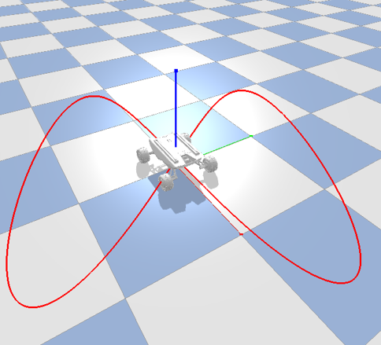

<div id="top" align="center">

# [GMPC: Geometric Model Predictive Control for Wheeled Mobile Robot Trajectory Tracking](https://arxiv.org/abs/2403.07317)

</div>

## Introduction
This is the official code repository of "**GMPC: Geometric Model Predictive Control for Wheeled Mobile Robot Trajectory Tracking**", which is accepted by RAL'24.

**GMPC** leverages the geometric properties of the kinematic model to design a model predictive controller for wheeled mobile robot trajectory tracking. 
The controller explores the relationship between Lie group and Lie algebra, and formulates the tracking problem as a convex optimization problem on the Lie algebra.
The proposed controller is validated on both simulation and real-world experiments, and is shown to outperform existing methods in terms of tracking smoothness and computational efficiency.


[preprint](https://arxiv.org/abs/2403.07317), [code](https://github.com/Garyandtang/GMPC-Tracking-Control)


If you find this work useful, please consider citing our paper:

```
@misc{tang2024gmpc,
      title={GMPC: Geometric Model Predictive Control for Wheeled Mobile Robot Trajectory Tracking}, 
      author={Jiawei Tang and Shuang Wu and Bo Lan and Yahui Dong and Yuqiang Jin and Guangjian Tian and Wen-An Zhang and Ling Shi},
      year={2024},
      eprint={2403.07317},
      archivePrefix={arXiv},
      primaryClass={eess.SY}
}
```


## Usage
We develop our **GMPC** controller based on the [manif](https://github.com/artivis/manif) and [CasADi](https://web.casadi.org/) libraries. The simulator is implemented in [PyBullet](https://pybullet.org/wordpress/).
All components of GMPC  and simulator are Python-based and ROS-free.

`For physical experiments, they are conducted on Ubuntu 18.04 with ROS Melodic.`
### Dependencies
1. [PyBullet](https://pybullet.org/wordpress/)
2. [manif](https://github.com/artivis/manif)
3. [CasADi](https://web.casadi.org/)
4. [numpy](https://numpy.org/)
5. [matplotlib](https://matplotlib.org/)

### Installation
1. clone the repository:
```bash
git clone https://github.com/Garyandtang/GMPC-Tracking-Control.git
cd GMPC-Tracking-Control
```
2. (optional) create a virtual environment
```bash
conda create -n gmpc python=3.11
conda activate gmpc
```
3. install the dependencies:
```bash
pip install -r requirements.txt
```
4. install the [manif](https://github.com/artivis/manif) library:
```bash
conda install -c conda-forge manifpy
```

4. Run the following command to test the GMPC controller in the simulation environment:
```bash
python problems/unicycle_traj_tracking/main_single_tracking_task.py
```


### Visualization

GMPC            |           Reference             |  NMPC
:-------------------------:|:-------------------------------:|:-------------------------:
  |  |  


### Physical Experiments
We also provide the code for physical experiments in the `problems/unicycle_traj_tracking` folder. 
To run the physical experiments, please follow the instructions of ScoutMini and Turtlebot3.
- [ScoutMini SDK](https://github.com/agilexrobotics/ugv_sdk)
- [Turtlebot3 emanual](https://emanual.robotis.com/docs/en/platform/turtlebot3/overview/)
### Thanks
We would like to thank the authors of the following repositories for their excellent work:
1. [safe-control-gym](https://github.com/utiasDSL/safe-control-gym)
2. [manif](https://github.com/artivis/manif)